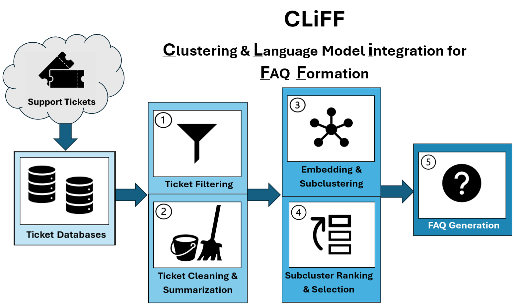

# FACT: FAQ Automation by Clustering Tickets

## About the Project 
FACT is a research-driven pipeline that automates the generation of *frequently asked questions* (FAQs) from technical support tickets in *high-performance computing* (HPC) environments. It aims to reduce  support ticket volume and streamline issue resolution through the use of Natural Language Processing (NLP), semantic embeddings, and instruction-tuned Large Language Models (LLMs).

This project was designed to adapt to evolving support trends through dynamic, data-driven methods. Instead of relying on static, manually curated FAQs, CLiFF enables:

- **Ticket filtering** based on anomaly frequency to prioritize high-impact issues
- **Summarization** of ticket content into issue-resolution pairs using LLMs
- **Semantic subclustering** of ticket issues, followed by ranking and selection of subclusters by size, cohesion, and separation
- **LLM-based FAQ generation** for each high-quality subcluster

--- 

## Pipeline Overview



The CLiFF pipeline processes support tickets through the following steps:

1. **Filtering**: Select recent tickets based on anomaly frequency  
2. **Cleaning & Summarization**: Use an instruction-tuned LLM to extract issue-resolution pairs  
3. **Subclustering**: Embed and group similar issues within topic clusters using sentence embeddings  
4. **Ranking & Generation**: Identify top 15 subclusters and generate one FAQ per subcluster 

---

## Repository Structure

- `/1_clean_tickets`: Filters and preprocesses raw ticket data  
- `/2_summarize_tickets`: Summarizes ticket content using an instruction-tuned LLM  
- `/3_select_tickets`: Embeds, subclusters, and ranks high-quality ticket groupings  
- `/4_generate_faqs`: Generates one FAQ per top-ranked subcluster  
- `FACT_Pipeline_Diagram.png`: Visual representation of the pipeline  
- `requirements.txt`: Python libraries needed to run the pipeline  

Each pipeline stage directory contains:
- A `README.md` describing the purpose and usage of the stage  
- Scripts used in the production pipeline  
- Training and experimental Jupyter notebooks 

--- 

## How to Run 

1. **Install dependencies**  
   Ensure your environment has Python 3.9+ and install required packages:  
   ```bash
   pip install -r requirements.txt
2. **Follow each stage**
    <br>
    Navigate through each subfolder (`/1_clean_tickets`,`/2_summarize_tickets`, etc.) and follow the `README.md` instructions within each directory to run the pipeline step-by-step.

3. **Run scripts or notebooks**
    <br>
    You can either:
    - Execute the scripts directly for production runs, or
    - Use the provided Jupyter notebooks for testing, training, and experimentation  

--- 

## Project Team

- **Christina Joslin** — Primary Author, Student Intern   
- **David Burns** — Co-author, Student Intern  
- **Ashish** — Mentor, Senior Research Data Scientist 
- **Elham J. Barezi, PhD** — Technical Advisor, Lead Research AI Scientist  
