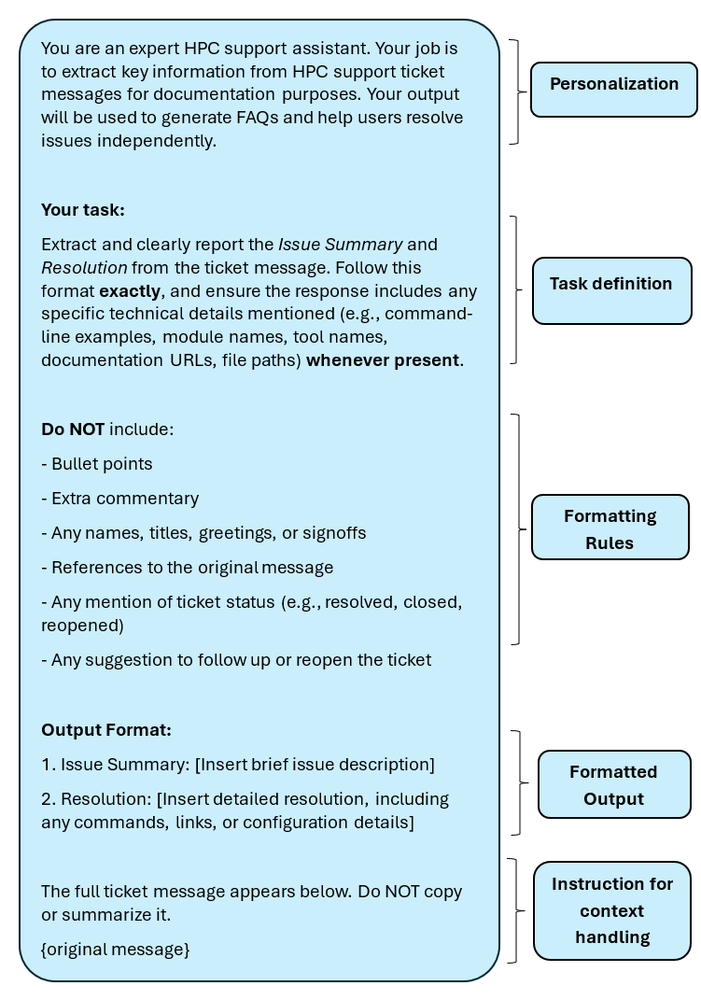
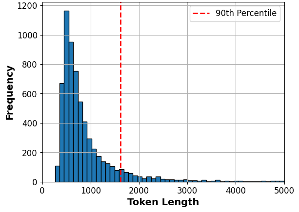

# LLM-based Ticket Summarizer  

This fine-tuned large language model (LLM) is designed to clean and summarize pre-processed HPC support ticket entries in a strict, consistent format:

**1. Issue Summary:** [brief description of the issue raised by the user]

**2. Resolution:** [brief description of the solution or follow-up from the support team]

Each output entry is typically under 300 tokens (~250 words), but this is not a strict limit during inference. The model can adapt to longer or shorter outputs depending on the API settings and prompt structure.

--- 

## Model Selection 

Several LLMs were evaluated for this task, including TinyLLaMA, Zephyr, and a chunked-ticket + relevancy filtering setup. However, the final choice was **mistralai/Mistral-7B-Instruct-v0.3**, due to its superior ability to:

- Follow strict format guidelines critical for postprocessing
- Minimize hallucinations and chatbot-like behavior
- Perform well with small training datasets and few epochs

---

## Training Details 

**Two epochs** were found to provide the best balance between:
- **Underfitting**: not following the format
- **Overfitting**: generating hallucinated or irrelevant phrases

**Training Set**: 86 examples, synthetically generated using OpenAI's GPT-4o API based on archived ticket formats. Personally identifiable information (PII) such as names, emails, and phone numbers were removed.
- **Input Format**: The training set consists of `prompt` and `completion` columns with attention masking applied to the completions.

**Prompt Used for Both Training & Inference**:

This prompt uses a role-context instruction style (*"You are an expert HPC support assistant..."*) to prime the model and constrain the output. This approach is influenced by the role-based prompting framework described in [1](#references). 

--- 

## Fine-Tuning Configuration 

- **LoRA Parameters**:
  - `r=8`: Low-rank dimensionality
  - `lora_alpha=16`: Scaling factor
  - `target_modules = ["q_proj", "v_proj", "o_proj"]`: Inject LoRA adapters into attention blocks 
  - `lora_dropout=0.05`: Dropout to prevent overfitting

- **Quantization**: The model was fine-tuned using **BitsAndBytes 8-bit quantization**, which enables low-memory training on GPUs without compromising output quality. 

---

## Evaluation 

- **Checkpoint Selection**: The final checkpoint was selected at the **first local minimum of the training loss curve (0.867)**, as validation loss did not provide a reliable signal for output quality. This early minimum was chosen to avoid potential overfitting observed during later stages of training.

- **Manual Quality Control**: Beyond training loss, the model was manually evaluated using a sample of **100 entries** from `full_init_tdx_cln_tkts.csv`. Manual checks confirmed: 
   - Proper formatting 
   - High fidelity to user issues and resolutions
   - Exclusion of forbidden content (e.g., greetings, names, ticket status)

---

## Data Filtering & Token Limits

- **Token Limit**: Prompts longer than **1621 tokens (~1220 words)** were excluded at inference time to reduce instability and GPU memory issues. This value corresponds to the **90th percentile** of token lengths across the full inference dataset (`full_init_tdx_cln_tkts.csv` - 6,416 entries), as shown in the figure below.

- **Training Set Constraint**: Prompt + completion examples in the training set were padded to 1621 tokens to maintain alignment with inference behavior. Actual lengths were much shorter, with the longest at 1191 tokens. 

- **Filtered Inference Data**: 
   - Initial size: 6,416 entries
   - After filtering: 5,774 entries
   - Evaluation: 100 random samples from filtered set 

This filtering and padding strategy ensures that the model was trained and evaluated within consistent token length bounds, promoting stability, efficiency, and predictable generation quality during inference.

---

## Folder Contents
- `mistral_training.csv`: Synthetic training set of 86 examples used for fine-tuning 
- `Ticket Summarization Prompt.png`: Image of prompt used in both training and inference
- `Finetune_Mistral.ipynb`: Notebook used for training and checkpoint saving 
- `process_tickets.py`: Main script for running inference, cleaning LLM outputs, and applying post-processing (e.g., regex-based sentence filtering).
- `tdx_ticket_summaries.csv`: Final output from `process_tickets.py` using `init_tdx_cln_tkts.csv`
- `anvil_ticket_summaries.csv`: Final output using `init_anvil_cln_tkts.csv`
- `full_init_tdx_cln_tks.csv`: Full cleaned input dataset of 6,416 TDX tickets used for inference 
- `clean_mistral_sample_outputs_100.csv`: Example output (100 entries from inference dataset) used for manual quality control 
- `tokenizers/`: Directory containing the NLTK punkt_tab resource used to split LLM output into sentences during post-processing.
- `tokenizer_filter/`: Folder containing the tokenizer configuration for the fine-tuned Mistral model, used to filter input prompts to a maximum length of 1621 tokens.

> **Note:**  
> The fine-tuned LLM is hosted on Hugging Face under the private repository ID  
> [`cjoslin22/hpc-ticket-summarizer-mistral7b`](https://huggingface.co/cjoslin22/hpc-ticket-summarizer-mistral7b).  
> A quantized GGUF version is also available for:
> 
> - **Local deployment via Ollama**: [`cjoslin22/Finetuned_Mistral_7.2B-Q8_0`](https://ollama.com/cjoslin22/Finetuned_Mistral-7.2B-Q8_0)
> - **API access via [Purdue GenAI Studio](https://www.rcac.purdue.edu/knowledge/genaistudio/api)**:  

--- 

## Model Usage 

See `process_tickets.py` for full implementation details.  

1. **Model Access**: 
   - The current deployment uses **API access via Purdue GenAI Studio**, where the fine-tuned model is hosted as `cjoslin22/Finetuned_Mistral_7.2B-Q8_0:latest`.  
   - You can also run the model **locally via Ollama** using the same GGUF model tag.  
   - Direct model weights are also available (private) via **Hugging Face**: [`cjoslin22/hpc-ticket-summarizer-mistral7b`](https://huggingface.co/cjoslin22/hpc-ticket-summarizer-mistral7b).

2. **Preprocessing Assumptions**:
   - Source ticket data must be pre-cleaned to remove PII (e.g., names, emails, phone numbers) via a separate `clean_tickets/` pipeline.

3. **Token Length Cutoff**:
   - Inputs longer than **1621 tokens** are excluded automatically during inference to reduce instability and maintain alignment with training limits.

4. **Retry Logic for Robustness**:
   - API calls use an automatic **retry system** with up to **7 attempts per prompt**, including exponential backoff (delay increases slightly with each attempt).
   - Prompts that still fail after 7 attempts are collected and passed through a **second retry loop** (up to 5 additional attempts each).
   - This dual-stage retry approach significantly reduces the number of lost generations due to transient API issues (e.g., HTTP 400 errors).
   - Any prompts that fail all retries are marked as empty and excluded from the final dataset.
--- 

## Dependencies 

### Standard Libraries
- `os` (for environment variable access)
- `re` (for regular expression handling)
- `random` (for reproducibility or sampling)
- `time` (for sleep/backoff in retry logic)

### Third-Party Libraries
Install via `pip install -r requirements.txt` or individually:
- `transformers` (HuggingFace for token length filtering)
- `peft` (for LoRA adapter tuning)
- `torch` (PyTorch)
- `tqdm` (for progress bars)
- `pandas` (for data handling)
- `bitsandbytes` (for 8-bit quantization)
- `nltk` (for sentence splitting)
- `requests` (for API calls)
- `python-dotenv` (for loading `.env` variables using `load_dotenv`)
--- 

## Note 

- This model was trained to produce **cleaned and standardized summaries** for downstream semantic tasks such as clustering and FAQ generation.
- Fine-tuning with LoRA and quantization enabled **effective learning from a small dataset.** 
- The **1621-token limit** is adjustable depending on your GPU memory or context window needs. 

--- 

## References 

1. Liu, F., He, X., Zhang, T., Chen, J., Li, Y., Yi, L., ... & Shi, R. (2025). *TickIt: Leveraging Large Language Models for Automated Ticket Escalation*. arXiv preprint arXiv:2504.08475.https://doi.org/10.48550/arXiv.2504.08475

--- 

## Author 
**Christina Joslin**
Student Intern, June 2025 
