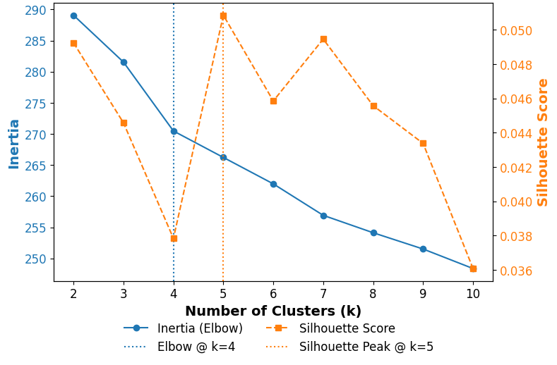
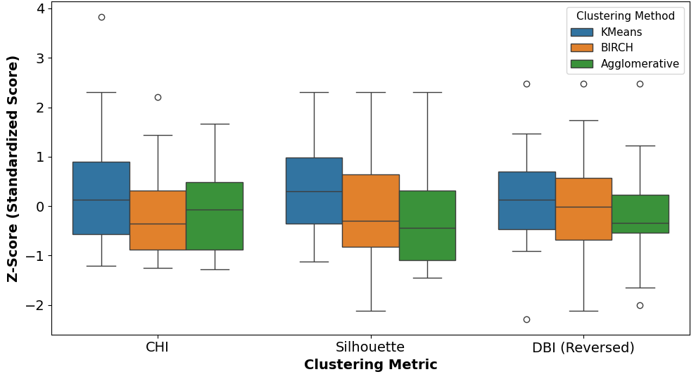
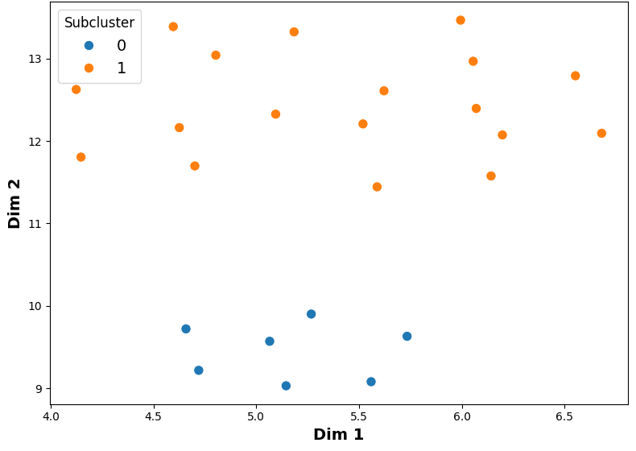

# Subcluster Ranking and Selection

This folder contains code for subclustering support ticket summaries and selecting high-utility groups for downstream FAQ generation. The pipeline builds on existing topic-based **parent clusters** and further partitions tickets into semantically meaningful **subclusters** using sentence embeddings and unsupervised clustering.

Each subcluster is scored based on three metrics: **size**, **semantic cohesion**, and **inter-cluster separation**.

---

## Embedding Model Selection

To convert ticket summaries into numerical representations, we evaluated four pretrained sentence embedding models:

- `nomic-embed-text-v1.5` (Nomic)
- `bge-m3` (BGE)
- `all-MiniLM-L6-v2` (MiniLM)
- `all-mpnet-base-v2` (MPNet)

Each model was evaluated using **K-Means clustering** over the full dataset, and performance was measured using:

- **Silhouette Score** (higher is better)
- **Davies-Bouldin Index (DBI)** (lower is better)

We determined the optimal number of clusters *k* for each model using the elbow method (inertia) and Silhouette Score. When the metrics disagreed, Silhouette Score was prioritized for its balanced view of cohesion and separation.

 
<em>Figure 1. Clustering evaluation for the <code>nomic-embed-text-v1.5</code> model using the elbow method (Inertia) and Silhouette Score across values of <em>k</em>. While the elbow occurs at <em>k = 4</em>, the Silhouette Score peaks at <em>k = 5</em>, which was selected as the optimal number of clusters.</em>

| **Model** | **Optimal k (TDX / Anvil)** | **Silhouette Score ↑ (TDX / Anvil)** | **DBI ↓ (TDX / Anvil)** |
|-----------|-----------------------------|---------------------------------------|---------------------------|
| `nomic`   | 7 / 5                       | 0.043 / 0.051                         | 3.523 / 3.874             |
| `bge-m3`  | 5 / 2                       | 0.045 / 0.039                         | 4.315 / 4.844             |
| `minilm`  | 7 / 7                       | 0.055 / 0.061                         | 3.221 / 3.472             |
| `mpnet`   | 10 / 5                      | **0.066** / **0.066**                 | **3.156** / **3.324**     |

**Selected model:** `all-mpnet-base-v2`, for best overall performance across both datasets (received highest Silhouette Score and lowest DBI for both datasets).

---

## Clustering Algorithm Selection

Six clustering algorithms were initially considered:

- K-Means
- Gaussian Mixture Model (GMM)
- Agglomerative Clustering
- BIRCH
- DBSCAN
- HDBSCAN

**Filtering process:**

- **DBSCAN** and **HDBSCAN** were excluded due to over-sensitivity to noise.
- **GMM** was excluded due to instability on PCA-reduced embeddings.

**Final evaluation:**  
The remaining algorithms were tested on **L2-normalized embeddings**, reduced from 768 to 10 dimensions using **Principal Component Analysis (PCA)**.

Metrics used:

- **Silhouette Score**
- **Davies-Bouldin Index (inverted)**
- **Calinski-Harabasz Index (CHI)**

To ensure a consistent scale, all metrics were **Z-score standardized**.  
**Final algorithm selected:** K-Means, which consistently outperformed the others as shown in Figure 2. 

 
<em>Figure 2. Standardized clustering metrics (Z-scores) comparing CHI, Silhouette, and reversed DBI (to ensure a higher score indicates better performance) across three algorithms. K-Means shows consistently better performance across all metrics with the highest medians and IQR values.</em>

  

 
<em>Figure 3. UMAP projection of a K-Means parent cluster with the best DBI score. Subclusters show strong cohesion and clear separation.</em>

---

## Subcluster Scoring

Each subcluster is given a composite score $Q_i$ using:

$$
Q_i = w_Z \cdot Z_i + w_C \cdot C_i + w_S \cdot S_i 
$$ 

where:

- $Z_i$: Normalized size
- $C_i$: Intra-cluster cohesion
- $S_i$: Inter-cluster separation

**Weights:**
- $w_Z = 0.4$
- $w_C = 1.2$
- $w_S = 0.2$

---

### Size 

The number of tickets in the subcluster, normalized using Min-Max scaling:

$$
Z_i = \frac{z_i - \min(z)}{\max(z) - \min(z)} 
$$

where $z_i$ represents the raw size values. 
> **Range:** [0,1]

--- 

### Cohesion

The average cosine similarity between all pairs of vectors in subcluster $i$:

$$
C_i = \frac{1}{n_i(n_i - 1)} \sum_{j \ne k} \text{cosine}(x_j, x_k)
$$ 

where:
- $n_i$: Number of tickets in subcluster $i$
- $x_j$, $x_k$: normalized embedding vectors

> **Range:** [0,1]
--- 

### Separation

The complement of average similarity between subcluster $i$ and all other subclusters:

$$
S_{ij} = 1 - \frac{1}{n_i n_j} \sum_{x \in X_i} \sum_{y \in X_j} \text{cosine}(x, y)
$$

$$
S_i = \frac{1}{|\mathcal{N}_i|} \sum_{j \in \mathcal{N}_i} S_{ij}
$$

where: 
- $X_i$, $X_j$: Sets of normalized embedding vectors
- $N_i$: All other subclusters in a given parent cluster 

> **Range:** [0,2]

--- 

## Filtering Criteria

To ensure useful FAQs:

- Remove subclusters with $Z_i < 0.05$ (too niche)
- Remove subclusters with $Z_i > 0.80$ (too broad)

--- 

## Semantic Representativeness

Within each selected subcluster, entries are ranked by cosine similarity to the **subcluster centroid** (based on L2-normalized PCA-reduced vectors). This ensures the most representative summaries are used for FAQ generation.

--- 

## Folder Contents
- `Evaluate_Embedding_Models.ipynb`: Compares four sentence embedding models using clustering metrics.
- `Evaluate_Cluster_Methods.ipynb`: Tests K-Means, BIRCH, and Agglomerative Clustering using normalized, reduced embeddings.
- `Subcluster_Ranking_And_Selection.ipynb`: Scores subclusters based on weighted combination of size, cohesion, and separation.
- `Scaled_Clustering_Metrics.png`: Boxplots comparing standardized clustering scores for K-Means, BIRCH, and Agglomerative.
- `KMeans_Best_DBI.png`: UMAP projection showing strong K-Means subclustering.
- `Sample_Elbow_And_Sihouette.png`: Example plot from the `all-mpnet-base-v2` model showing Inertia (elbow method) and Silhouette Score across values of *k*. 
- `cluster_helper.py`: Implementation file with utility functions for subclustering, scoring, and ranking FAQ candidates.
- `generate_subclusters.py`: Main script for generating and scoring subclusters from parent clusters using sentence embeddings.
- `select_subclusters.py`: Configuration and runtime script for filtering and selecting top-ranked subclusters during production.

--- 

## Dependencies

### Standard Libraries  
- `os` (for environment management and path handling)  
- `math` (for mathematical operations)  
- `json` (for reading and writing JSON files)  
- `collections` (for specialized data structures like `defaultdict` and `Counter`)  

### Third-Party Libraries  
Install via `pip install -r requirements.txt` or individually:
- `numpy` (for numerical array operations)  
- `pandas` (for data manipulation and analysis)  
- `scikit-learn` (for machine learning and clustering algorithms)  
- `sentence-transformers` (for generating sentence embeddings)  
- `tqdm` (for progress bars during iteration)  
- `umap` (for dimensionality reduction)

---

## Author
**Christina Joslin**
Student Intern, July 2025
