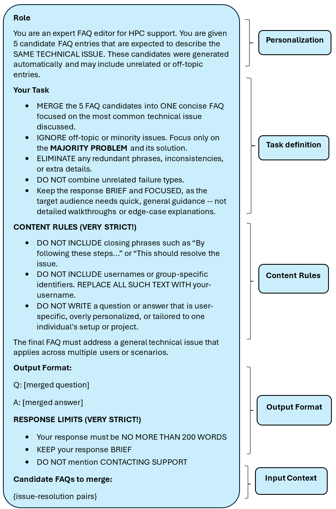
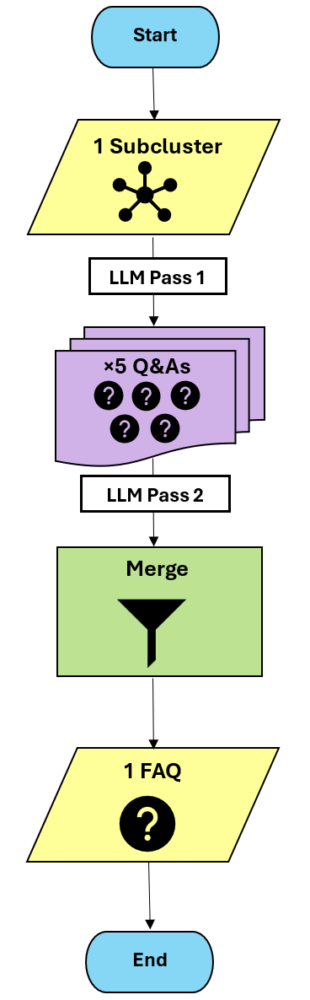

# FAQ-Generation Module 

This folder contains code and artifacts for generating high-quality FAQs from HPC support ticket subclusters using an LLM-based structured generation pipeline.

The module selects the top-ranked subclusters from each dataset and uses an instruction-tuned LLM (`Phi-4`) to generate one FAQ per subcluster. 

--- 

## Method Overview

1. **Subcluster Selection**  
The top 15 subclusters per dataset were selected (or fewer if the normalized cluster size fell outside the 0.05–0.80 threshold).  
   - **Anvil:** 12 subclusters  
   - **TDX:** 15 subclusters  

2. **FAQ Generation**  
Each subcluster is passed through an instruction-tuned LLM (`Phi-4`) using a structured few-shot prompt to generate 5 candidate Q&A pairs.  
   - Issue summaries and resolutions are appended to the prompt until a **2,000-word input limit** is reached  
   - Each prompt uses **few-shot learning** and enforces formatting compliance  

### *Few-Shot Examples Included in Prompt*

<blockquote>
<strong>General FAQ Example</strong>  
<strong>Q: What should I do if my SSH connection hangs?
</strong> 
<strong>A:</strong> If your terminal hangs while connecting via SSH, try the following steps: 
1. <strong>Check your network connection</strong>, especially if you're on Wi-Fi. A weak or unstable connection can cause SSH to hang. 
2. <strong>Retry the connection.</strong> Sometimes, a login node may be temporarily overloaded. Attempt reconnecting after a short wait. 
3. <strong>Switch to a different front-end node</strong> if available. File system issues on the current node (e.g., home, scratch, or depot) may cause the terminal to freeze.
</blockquote>

<blockquote>
<strong>Cluster-Specific FAQ Example (Bell)</strong>  
<strong>Q: Does the Bell cluster share the same home directory as other RCAC clusters?</strong> 

<strong>A:</strong> No. The Bell cluster uses a <strong>separate home directory</strong>, which is only accessible from Bell's front-end and compute nodes. This directory is <strong>not shared</strong> with other RCAC systems.  
To access files from your main RCAC home directory: 
- <strong>Manually copy files</strong> using tools like <code>rsync</code> or <code>scp</code> from another cluster. 
- If you plan to use <code>hsi</code> or <code>htar</code> from Bell, refer to the <strong>keytab generation</strong> FAQ for a temporary workaround due to a known integration issue.
</blockquote>

3. **Consolidation (LLM Pass 2)**  
   The 5 Q&A candidates are merged into a single Q&A using a second structured prompt that emphasizes majority-topic alignment and formatting precision.  
   - Consolidation prompt applies strict role, content, and output format rules  
   - Final output is exported in Markdown for manual and automated evaluation  

### Prompt Overview – Candidate Merging

---

## Generation Settings

- **Model**: `Phi-4` (instruction-tuned)  
- **Prompt Strategy**: Role-Context-Task 
- **Temperature**: `0.2` (low variability)  
- **Token Limit**: 250 tokens  
- **Word Limit**: 200 words (prompt-set limit) 
- **Format Enforcement**:  
  - No user-specific info (e.g., usernames)
  - No closing phrases

--- 

## Pipeline Overview

Each subcluster undergoes:
1. Generation of 5 Q&As using Phi-4  
2. Consolidation into one merged FAQ  
3. Export to Markdown format  

---

## Folder Contents
- `anvil_clean_parsed_faqs.md`: 12 final FAQs for Anvil 
- `tdx_clean_parsed_faqs.md` 15 final FAQs for TDX 
- `FAQ_Candidate_Merging_Prompt.png` Prompt used to merge the 5 FAQ candidates per subcluster 
- `faq_gen.py` Script to run FAQ generation and merging 
- `FAQ_Generation_Module.png` Diagram of FAQ Generation Module 

--- 

## Dependencies

### Standard Libraries  
- `os` (for environment variable access)  
- `re` (for regular expression handling)  

### Third-Party Libraries  
Install via `pip install -r requirements.txt` or individually:
- `pandas` (for data handling)  
- `requests` (for API calls)  
- `python-dotenv` (for loading `.env` variables using `load_dotenv`)

---

## Author
**Christina Joslin**
Student Intern, July 2025